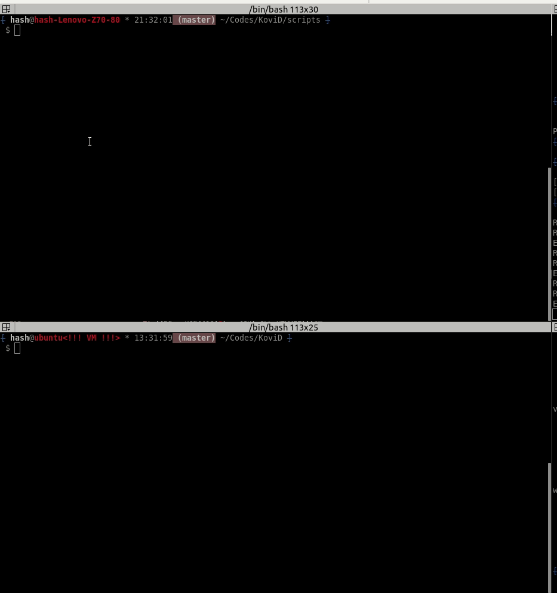
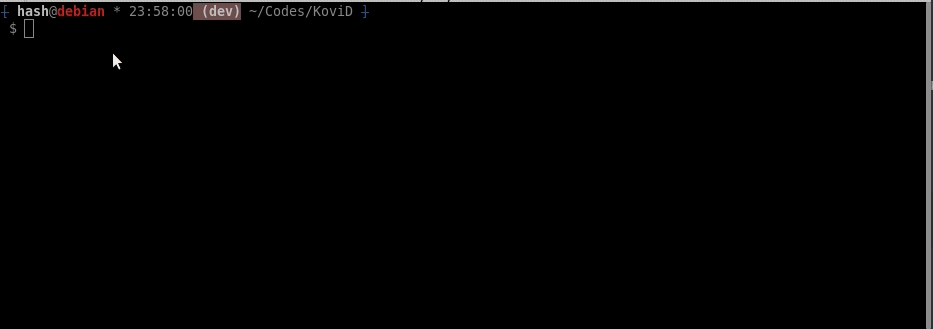

# Demos

## Simple netcat reverse shell

## Hide process & CPU usage
CPU usage is handled automatically if the process is hidden

## Log tty keys and steal passwords over SSH (and FTP)

* Gotcha: mistyped and copy & paste keys are missed

## Extract base address of a running process

