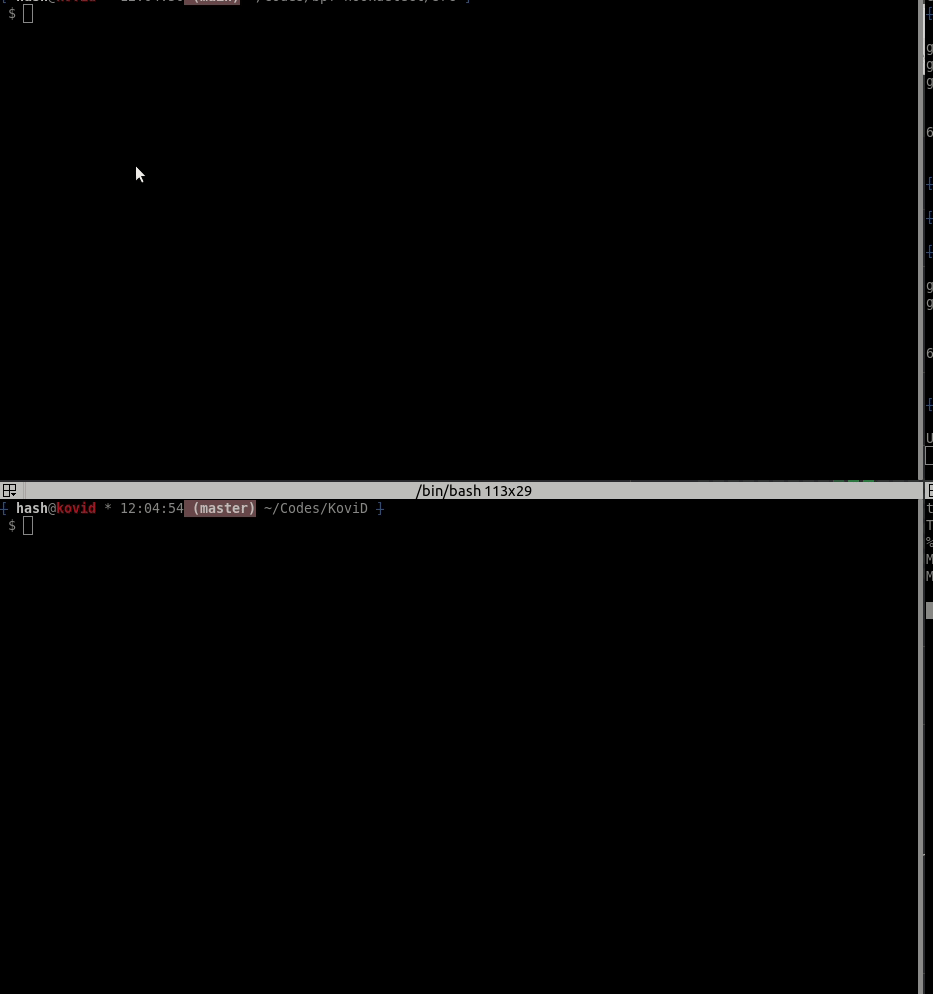

# Demos

## Simple netcat reverse shell

## Hide process & CPU usage
##### CPU usage is handled automatically if the process is hidden.

> Pro-tip: don't use 100% of all available CPU's at the same time

## Log tty keys and steal passwords over SSH (and FTP)

> Gotcha: mistyped and copy & paste keys will not be logged

## Extract base address of a running process

## Block BPF syscall stack analysis for hooked functions
##### If BPF tools will fail if attempt to try and read from syscall stack traces. KoviD will force will clear the stack trace and force an error.

> [bpf-hookdetect](https://github.com/pathtofile/bpf-hookdetect) possible false positives for sys_getdents - KoviD does not hook sys_getdents family.

## Simple persistence using ELF infection with Volundr
##### Persist rootkit between reboots with the help of [Volundr](https://github.com/carloslack/volundr)
##### md5sum output for the modified ELF is automatically hijacked by KoviD

> KoviD must be running at the time install.sh is called so the new md5sum output can be applied to the new modified ELF.
> This is very specific for `md5sum` tool only and `md5sum -c` is not handled.
